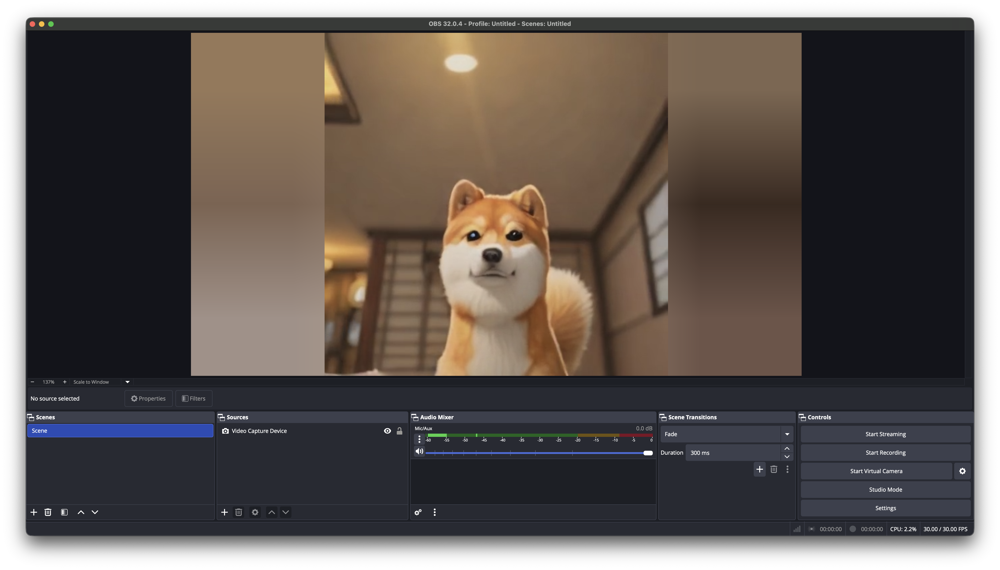

# Daydream for OBS



A real-time AI video processing plugin for OBS Studio. Apply live generative AI effects to your streams using diffusion models powered by [Daydream](https://daydream.live).

## Features

- Real-time AI transformations via stable diffusion models
- Multiple prompt scheduling with weighted interpolation
- ControlNet support (depth, canny, pose, etc.)
- IP-Adapter for image-guided generation
- Low-latency WebRTC streaming (WHIP/WHEP)

## Requirements

- OBS Studio 31.1+
- macOS 12.0+ / Windows 10+ / Linux
- A [Daydream](https://daydream.live) account

## Installation

Download the latest release from the [Releases](https://github.com/livepeer/daydream-obs/releases) page and install:

| Platform | Install Location                                    |
| -------- | --------------------------------------------------- |
| macOS    | `~/Library/Application Support/obs-studio/plugins/` |
| Windows  | `%APPDATA%\obs-studio\plugins\`                     |
| Linux    | `~/.config/obs-studio/plugins/`                     |

Restart OBS after installing.

## Usage

1. Open OBS and add a video source (camera, window capture, etc.)
2. Right-click the source → **Filters** → **+** → **Daydream**
3. Click **Login** to authenticate with your Daydream account
4. Enter a prompt describing your desired effect
5. Toggle the filter on to start streaming

## Building from Source

### Prerequisites

- CMake 3.28+
- Platform toolchain (Xcode on macOS, Visual Studio 2022 on Windows, GCC on Linux)

### macOS

```bash
cmake --preset macos
cmake --build build_macos --config Debug
```

Install via symlink for development:

```bash
ln -sf "$(pwd)/build_macos/Debug/daydream-obs.plugin" \
  ~/Library/Application\ Support/obs-studio/plugins/
```

### Windows

```bash
cmake --preset windows-x64
cmake --build build_windows --config Release
```

### Linux

```bash
cmake --preset ubuntu-x86_64
cmake --build build_ubuntu
```

## License

See [LICENSE](LICENSE) for details.
